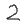

# Imports


```python
from numpy.random import seed
seed(888)
from tensorflow import set_random_seed
set_random_seed(404)
```


```python
import os
import numpy as np
import tensorflow as tf

from time import strftime
from PIL import Image
```

# Constants


```python
X_TRAIN_PATH='MNIST/digit_xtrain.csv'
X_TEST_PATH='MNIST/digit_xtest.csv'
Y_TRAIN_PATH='MNIST/digit_ytrain.csv'
Y_TEST_PATH='MNIST/digit_ytest.csv'

LOGGING_PATH='tensorboard_digit_logs/'

NR_CLASSES=10
VALIDATION_SIZE=10000
IMAGE_WIDTH=28
IMAGE_HEIGHT=28
CHANNELS=1
TOTAL_INPUTS=784
```

# Get the Data


```python
%%time

y_train_all=np.loadtxt(Y_TRAIN_PATH,delimiter=',',dtype=int)
```

    Wall time: 184 ms
    


```python
y_train_all.shape
```


    (60000,)


```python
%%time

y_test_all=np.loadtxt(Y_TEST_PATH,delimiter=',',dtype=int)
```

    Wall time: 29 ms
    


```python
%%time

x_train_all=np.loadtxt(X_TRAIN_PATH,delimiter=',',dtype=int)
```

    Wall time: 24.6 s
    


```python
%%time

x_test_all=np.loadtxt(X_TEST_PATH,delimiter=',',dtype=int)
```

    Wall time: 4.26 s
    

# Explore


```python
x_train_all.shape
```


    (60000, 784)


```python
x_train_all[0]
```


    array([  0,   0,   0,   0,   0,   0,   0,   0,   0,   0,   0,   0,   0,
             0,   0,   0,   0,   0,   0,   0,   0,   0,   0,   0,   0,   0,
             0,   0,   0,   0,   0,   0,   0,   0,   0,   0,   0,   0,   0,
             0,   0,   0,   0,   0,   0,   0,   0,   0,   0,   0,   0,   0,
             0,   0,   0,   0,   0,   0,   0,   0,   0,   0,   0,   0,   0,
             0,   0,   0,   0,   0,   0,   0,   0,   0,   0,   0,   0,   0,
             0,   0,   0,   0,   0,   0,   0,   0,   0,   0,   0,   0,   0,
             0,   0,   0,   0,   0,   0,   0,   0,   0,   0,   0,   0,   0,
             0,   0,   0,   0,   0,   0,   0,   0,   0,   0,   0,   0,   0,
             0,   0,   0,   0,   0,   0,   0,   0,   0,   0,   0,   0,   0,
             0,   0,   0,   0,   0,   0,   0,   0,   0,   0,   0,   0,   0,
             0,   0,   0,   0,   0,   0,   0,   0,   0,   3,  18,  18,  18,
           126, 136, 175,  26, 166, 255, 247, 127,   0,   0,   0,   0,   0,
             0,   0,   0,   0,   0,   0,   0,  30,  36,  94, 154, 170, 253,
           253, 253, 253, 253, 225, 172, 253, 242, 195,  64,   0,   0,   0,
             0,   0,   0,   0,   0,   0,   0,   0,  49, 238, 253, 253, 253,
           253, 253, 253, 253, 253, 251,  93,  82,  82,  56,  39,   0,   0,
             0,   0,   0,   0,   0,   0,   0,   0,   0,   0,  18, 219, 253,
           253, 253, 253, 253, 198, 182, 247, 241,   0,   0,   0,   0,   0,
             0,   0,   0,   0,   0,   0,   0,   0,   0,   0,   0,   0,   0,
            80, 156, 107, 253, 253, 205,  11,   0,  43, 154,   0,   0,   0,
             0,   0,   0,   0,   0,   0,   0,   0,   0,   0,   0,   0,   0,
             0,   0,   0,  14,   1, 154, 253,  90,   0,   0,   0,   0,   0,
             0,   0,   0,   0,   0,   0,   0,   0,   0,   0,   0,   0,   0,
             0,   0,   0,   0,   0,   0,   0, 139, 253, 190,   2,   0,   0,
             0,   0,   0,   0,   0,   0,   0,   0,   0,   0,   0,   0,   0,
             0,   0,   0,   0,   0,   0,   0,   0,   0,  11, 190, 253,  70,
             0,   0,   0,   0,   0,   0,   0,   0,   0,   0,   0,   0,   0,
             0,   0,   0,   0,   0,   0,   0,   0,   0,   0,   0,   0,  35,
           241, 225, 160, 108,   1,   0,   0,   0,   0,   0,   0,   0,   0,
             0,   0,   0,   0,   0,   0,   0,   0,   0,   0,   0,   0,   0,
             0,   0,  81, 240, 253, 253, 119,  25,   0,   0,   0,   0,   0,
             0,   0,   0,   0,   0,   0,   0,   0,   0,   0,   0,   0,   0,
             0,   0,   0,   0,   0,  45, 186, 253, 253, 150,  27,   0,   0,
             0,   0,   0,   0,   0,   0,   0,   0,   0,   0,   0,   0,   0,
             0,   0,   0,   0,   0,   0,   0,   0,  16,  93, 252, 253, 187,
             0,   0,   0,   0,   0,   0,   0,   0,   0,   0,   0,   0,   0,
             0,   0,   0,   0,   0,   0,   0,   0,   0,   0,   0,   0, 249,
           253, 249,  64,   0,   0,   0,   0,   0,   0,   0,   0,   0,   0,
             0,   0,   0,   0,   0,   0,   0,   0,   0,   0,   0,  46, 130,
           183, 253, 253, 207,   2,   0,   0,   0,   0,   0,   0,   0,   0,
             0,   0,   0,   0,   0,   0,   0,   0,   0,   0,   0,  39, 148,
           229, 253, 253, 253, 250, 182,   0,   0,   0,   0,   0,   0,   0,
             0,   0,   0,   0,   0,   0,   0,   0,   0,   0,   0,  24, 114,
           221, 253, 253, 253, 253, 201,  78,   0,   0,   0,   0,   0,   0,
             0,   0,   0,   0,   0,   0,   0,   0,   0,   0,   0,  23,  66,
           213, 253, 253, 253, 253, 198,  81,   2,   0,   0,   0,   0,   0,
             0,   0,   0,   0,   0,   0,   0,   0,   0,   0,   0,  18, 171,
           219, 253, 253, 253, 253, 195,  80,   9,   0,   0,   0,   0,   0,
             0,   0,   0,   0,   0,   0,   0,   0,   0,   0,   0,  55, 172,
           226, 253, 253, 253, 253, 244, 133,  11,   0,   0,   0,   0,   0,
             0,   0,   0,   0,   0,   0,   0,   0,   0,   0,   0,   0,   0,
           136, 253, 253, 253, 212, 135, 132,  16,   0,   0,   0,   0,   0,
             0,   0,   0,   0,   0,   0,   0,   0,   0,   0,   0,   0,   0,
             0,   0,   0,   0,   0,   0,   0,   0,   0,   0,   0,   0,   0,
             0,   0,   0,   0,   0,   0,   0,   0,   0,   0,   0,   0,   0,
             0,   0,   0,   0,   0,   0,   0,   0,   0,   0,   0,   0,   0,
             0,   0,   0,   0,   0,   0,   0,   0,   0,   0,   0,   0,   0,
             0,   0,   0,   0,   0,   0,   0,   0,   0,   0,   0,   0,   0,
             0,   0,   0,   0,   0,   0,   0,   0,   0,   0,   0,   0,   0,
             0,   0,   0,   0])


```python
y_train_all.shape
```


    (60000,)


```python
x_test_all.shape
```


    (10000, 784)


```python
y_train_all[:5]
```


    array([5, 0, 4, 1, 9])


# Pre-Processing


```python
# Re-Scale
x_train_all,x_test_all=x_train_all/255.0,x_test_all/255.0
```


```python
x_train_all[0]
```


    array([0.        , 0.        , 0.        , 0.        , 0.        ,
           0.        , 0.        , 0.        , 0.        , 0.        ,
           0.        , 0.        , 0.        , 0.        , 0.        ,
           0.        , 0.        , 0.        , 0.        , 0.        ,
           0.        , 0.        , 0.        , 0.        , 0.        ,
           0.        , 0.        , 0.        , 0.        , 0.        ,
           0.        , 0.        , 0.        , 0.        , 0.        ,
           0.        , 0.        , 0.        , 0.        , 0.        ,
           0.        , 0.        , 0.        , 0.        , 0.        ,
           0.        , 0.        , 0.        , 0.        , 0.        ,
           0.        , 0.        , 0.        , 0.        , 0.        ,
           0.        , 0.        , 0.        , 0.        , 0.        ,
           0.        , 0.        , 0.        , 0.        , 0.        ,
           0.        , 0.        , 0.        , 0.        , 0.        ,
           0.        , 0.        , 0.        , 0.        , 0.        ,
           0.        , 0.        , 0.        , 0.        , 0.        ,
           0.        , 0.        , 0.        , 0.        , 0.        ,
           0.        , 0.        , 0.        , 0.        , 0.        ,
           0.        , 0.        , 0.        , 0.        , 0.        ,
           0.        , 0.        , 0.        , 0.        , 0.        ,
           0.        , 0.        , 0.        , 0.        , 0.        ,
           0.        , 0.        , 0.        , 0.        , 0.        ,
           0.        , 0.        , 0.        , 0.        , 0.        ,
           0.        , 0.        , 0.        , 0.        , 0.        ,
           0.        , 0.        , 0.        , 0.        , 0.        ,
           0.        , 0.        , 0.        , 0.        , 0.        ,
           0.        , 0.        , 0.        , 0.        , 0.        ,
           0.        , 0.        , 0.        , 0.        , 0.        ,
           0.        , 0.        , 0.        , 0.        , 0.        ,
           0.        , 0.        , 0.        , 0.        , 0.        ,
           0.        , 0.        , 0.01176471, 0.07058824, 0.07058824,
           0.07058824, 0.49411765, 0.53333333, 0.68627451, 0.10196078,
           0.65098039, 1.        , 0.96862745, 0.49803922, 0.        ,
           0.        , 0.        , 0.        , 0.        , 0.        ,
           0.        , 0.        , 0.        , 0.        , 0.        ,
           0.        , 0.11764706, 0.14117647, 0.36862745, 0.60392157,
           0.66666667, 0.99215686, 0.99215686, 0.99215686, 0.99215686,
           0.99215686, 0.88235294, 0.6745098 , 0.99215686, 0.94901961,
           0.76470588, 0.25098039, 0.        , 0.        , 0.        ,
           0.        , 0.        , 0.        , 0.        , 0.        ,
           0.        , 0.        , 0.        , 0.19215686, 0.93333333,
           0.99215686, 0.99215686, 0.99215686, 0.99215686, 0.99215686,
           0.99215686, 0.99215686, 0.99215686, 0.98431373, 0.36470588,
           0.32156863, 0.32156863, 0.21960784, 0.15294118, 0.        ,
           0.        , 0.        , 0.        , 0.        , 0.        ,
           0.        , 0.        , 0.        , 0.        , 0.        ,
           0.        , 0.07058824, 0.85882353, 0.99215686, 0.99215686,
           0.99215686, 0.99215686, 0.99215686, 0.77647059, 0.71372549,
           0.96862745, 0.94509804, 0.        , 0.        , 0.        ,
           0.        , 0.        , 0.        , 0.        , 0.        ,
           0.        , 0.        , 0.        , 0.        , 0.        ,
           0.        , 0.        , 0.        , 0.        , 0.        ,
           0.31372549, 0.61176471, 0.41960784, 0.99215686, 0.99215686,
           0.80392157, 0.04313725, 0.        , 0.16862745, 0.60392157,
           0.        , 0.        , 0.        , 0.        , 0.        ,
           0.        , 0.        , 0.        , 0.        , 0.        ,
           0.        , 0.        , 0.        , 0.        , 0.        ,
           0.        , 0.        , 0.        , 0.        , 0.05490196,
           0.00392157, 0.60392157, 0.99215686, 0.35294118, 0.        ,
           0.        , 0.        , 0.        , 0.        , 0.        ,
           0.        , 0.        , 0.        , 0.        , 0.        ,
           0.        , 0.        , 0.        , 0.        , 0.        ,
           0.        , 0.        , 0.        , 0.        , 0.        ,
           0.        , 0.        , 0.        , 0.        , 0.54509804,
           0.99215686, 0.74509804, 0.00784314, 0.        , 0.        ,
           0.        , 0.        , 0.        , 0.        , 0.        ,
           0.        , 0.        , 0.        , 0.        , 0.        ,
           0.        , 0.        , 0.        , 0.        , 0.        ,
           0.        , 0.        , 0.        , 0.        , 0.        ,
           0.        , 0.        , 0.04313725, 0.74509804, 0.99215686,
           0.2745098 , 0.        , 0.        , 0.        , 0.        ,
           0.        , 0.        , 0.        , 0.        , 0.        ,
           0.        , 0.        , 0.        , 0.        , 0.        ,
           0.        , 0.        , 0.        , 0.        , 0.        ,
           0.        , 0.        , 0.        , 0.        , 0.        ,
           0.        , 0.1372549 , 0.94509804, 0.88235294, 0.62745098,
           0.42352941, 0.00392157, 0.        , 0.        , 0.        ,
           0.        , 0.        , 0.        , 0.        , 0.        ,
           0.        , 0.        , 0.        , 0.        , 0.        ,
           0.        , 0.        , 0.        , 0.        , 0.        ,
           0.        , 0.        , 0.        , 0.        , 0.        ,
           0.31764706, 0.94117647, 0.99215686, 0.99215686, 0.46666667,
           0.09803922, 0.        , 0.        , 0.        , 0.        ,
           0.        , 0.        , 0.        , 0.        , 0.        ,
           0.        , 0.        , 0.        , 0.        , 0.        ,
           0.        , 0.        , 0.        , 0.        , 0.        ,
           0.        , 0.        , 0.        , 0.        , 0.17647059,
           0.72941176, 0.99215686, 0.99215686, 0.58823529, 0.10588235,
           0.        , 0.        , 0.        , 0.        , 0.        ,
           0.        , 0.        , 0.        , 0.        , 0.        ,
           0.        , 0.        , 0.        , 0.        , 0.        ,
           0.        , 0.        , 0.        , 0.        , 0.        ,
           0.        , 0.        , 0.        , 0.0627451 , 0.36470588,
           0.98823529, 0.99215686, 0.73333333, 0.        , 0.        ,
           0.        , 0.        , 0.        , 0.        , 0.        ,
           0.        , 0.        , 0.        , 0.        , 0.        ,
           0.        , 0.        , 0.        , 0.        , 0.        ,
           0.        , 0.        , 0.        , 0.        , 0.        ,
           0.        , 0.        , 0.        , 0.97647059, 0.99215686,
           0.97647059, 0.25098039, 0.        , 0.        , 0.        ,
           0.        , 0.        , 0.        , 0.        , 0.        ,
           0.        , 0.        , 0.        , 0.        , 0.        ,
           0.        , 0.        , 0.        , 0.        , 0.        ,
           0.        , 0.        , 0.        , 0.18039216, 0.50980392,
           0.71764706, 0.99215686, 0.99215686, 0.81176471, 0.00784314,
           0.        , 0.        , 0.        , 0.        , 0.        ,
           0.        , 0.        , 0.        , 0.        , 0.        ,
           0.        , 0.        , 0.        , 0.        , 0.        ,
           0.        , 0.        , 0.        , 0.        , 0.15294118,
           0.58039216, 0.89803922, 0.99215686, 0.99215686, 0.99215686,
           0.98039216, 0.71372549, 0.        , 0.        , 0.        ,
           0.        , 0.        , 0.        , 0.        , 0.        ,
           0.        , 0.        , 0.        , 0.        , 0.        ,
           0.        , 0.        , 0.        , 0.        , 0.        ,
           0.09411765, 0.44705882, 0.86666667, 0.99215686, 0.99215686,
           0.99215686, 0.99215686, 0.78823529, 0.30588235, 0.        ,
           0.        , 0.        , 0.        , 0.        , 0.        ,
           0.        , 0.        , 0.        , 0.        , 0.        ,
           0.        , 0.        , 0.        , 0.        , 0.        ,
           0.        , 0.09019608, 0.25882353, 0.83529412, 0.99215686,
           0.99215686, 0.99215686, 0.99215686, 0.77647059, 0.31764706,
           0.00784314, 0.        , 0.        , 0.        , 0.        ,
           0.        , 0.        , 0.        , 0.        , 0.        ,
           0.        , 0.        , 0.        , 0.        , 0.        ,
           0.        , 0.        , 0.07058824, 0.67058824, 0.85882353,
           0.99215686, 0.99215686, 0.99215686, 0.99215686, 0.76470588,
           0.31372549, 0.03529412, 0.        , 0.        , 0.        ,
           0.        , 0.        , 0.        , 0.        , 0.        ,
           0.        , 0.        , 0.        , 0.        , 0.        ,
           0.        , 0.        , 0.        , 0.21568627, 0.6745098 ,
           0.88627451, 0.99215686, 0.99215686, 0.99215686, 0.99215686,
           0.95686275, 0.52156863, 0.04313725, 0.        , 0.        ,
           0.        , 0.        , 0.        , 0.        , 0.        ,
           0.        , 0.        , 0.        , 0.        , 0.        ,
           0.        , 0.        , 0.        , 0.        , 0.        ,
           0.        , 0.53333333, 0.99215686, 0.99215686, 0.99215686,
           0.83137255, 0.52941176, 0.51764706, 0.0627451 , 0.        ,
           0.        , 0.        , 0.        , 0.        , 0.        ,
           0.        , 0.        , 0.        , 0.        , 0.        ,
           0.        , 0.        , 0.        , 0.        , 0.        ,
           0.        , 0.        , 0.        , 0.        , 0.        ,
           0.        , 0.        , 0.        , 0.        , 0.        ,
           0.        , 0.        , 0.        , 0.        , 0.        ,
           0.        , 0.        , 0.        , 0.        , 0.        ,
           0.        , 0.        , 0.        , 0.        , 0.        ,
           0.        , 0.        , 0.        , 0.        , 0.        ,
           0.        , 0.        , 0.        , 0.        , 0.        ,
           0.        , 0.        , 0.        , 0.        , 0.        ,
           0.        , 0.        , 0.        , 0.        , 0.        ,
           0.        , 0.        , 0.        , 0.        , 0.        ,
           0.        , 0.        , 0.        , 0.        , 0.        ,
           0.        , 0.        , 0.        , 0.        , 0.        ,
           0.        , 0.        , 0.        , 0.        , 0.        ,
           0.        , 0.        , 0.        , 0.        , 0.        ,
           0.        , 0.        , 0.        , 0.        , 0.        ,
           0.        , 0.        , 0.        , 0.        , 0.        ,
           0.        , 0.        , 0.        , 0.        ])


```python
values=y_train_all[:5]
np.eye(10)[values]
```


    array([[0., 0., 0., 0., 0., 1., 0., 0., 0., 0.],
           [1., 0., 0., 0., 0., 0., 0., 0., 0., 0.],
           [0., 0., 0., 0., 1., 0., 0., 0., 0., 0.],
           [0., 1., 0., 0., 0., 0., 0., 0., 0., 0.],
           [0., 0., 0., 0., 0., 0., 0., 0., 0., 1.]])


```python
np.eye(5)[[4,2]]
```


    array([[0., 0., 0., 0., 1.],
           [0., 0., 1., 0., 0.]])


```python
y_train_all=np.eye(10)[y_train_all]
```


```python
y_train_all.shape
```


    (60000, 10)


```python
y_test_all=np.eye(10)[y_test_all]
```


```python
y_test_all.shape
```


    (10000, 10)


```python
x_val=x_train_all[:VALIDATION_SIZE]
y_val=y_train_all[:VALIDATION_SIZE]

x_train=x_train_all[VALIDATION_SIZE:]
y_train=y_train_all[VALIDATION_SIZE:]
```


```python
x_train.shape
```


    (50000, 784)


```python
x_val.shape
```


    (10000, 784)


# Setup Tensorflow Graph


```python
X=tf.placeholder(tf.float32,shape=[None,784])
Y=tf.placeholder(tf.float32,shape=[None,NR_CLASSES])
```

### Architecture


```python
nr_epochs=50
learning_rate=0.001

n_hidden1=512
n_hidden2=64

```


```python
initial_w1 = tf.truncated_normal(shape=[784,n_hidden1],
                                stddev=0.1,seed=42)
```


```python
w1=tf.Variable(initial_value=initial_w1)
```


```python
initial_b1 = tf.constant(value=0.0,shape=[n_hidden1])
b1=tf.Variable(initial_value=initial_b1)
```


```python
layer1_in=tf.matmul(X,w1) + b1
```


```python
layer1_out = tf.nn.relu(layer1_in)
```


```python
initial_w2=tf.truncated_normal(shape=[n_hidden1,n_hidden2],
                              stddev=0.1,seed=42)
w2=tf.Variable(initial_value=initial_w2)
```


```python
initial_b2=tf.constant(value=0.0,shape=[n_hidden2])
b2=tf.Variable(initial_value=initial_b2)
```


```python
layer2_in=tf.matmul(layer1_out,w2)+b2
```


```python
layer2_out=tf.nn.relu(layer2_in)
```


```python
with tf.name_scope('output_layer'):
    initial_w3=tf.truncated_normal(shape=[n_hidden2,10],
                                  stddev=0.1,seed=42)
    w3=tf.Variable(initial_value=initial_w3)

    initial_b3=tf.constant(value=0.0,shape=[10])
    b3=tf.Variable(initial_value=initial_b3)

    layer3_in=tf.matmul(layer2_out,w3)+b3
    output=tf.nn.softmax(layer3_in)
```

# Tensorboard Setup


```python
folder_name=f'model_1 at {strftime("%H %M")}'
dir_paths=os.path.join(LOGGING_PATH,folder_name)

try:
    os.makedirs(dir_paths)
except OSError as err:
    print(err.strerror)
else:
    print('Successfully created directory')
```

    Successfully created directory
    

# Loss,Optimization and Metrics


```python
loss=tf.reduce_mean(tf.nn.softmax_cross_entropy_with_logits_v2(labels=Y,
                                                logits=output))
```


```python
optimizer=tf.train.AdamOptimizer(learning_rate)
train_step=optimizer.minimize(loss)
```


```python
correct_pred=tf.equal(tf.argmax(output,axis=1),tf.argmax(Y,axis=1))
accuracy=tf.reduce_mean(tf.cast(correct_pred,tf.float32))
```


```python
tf.summary.scalar('accuracy',accuracy)
```


    <tf.Tensor 'accuracy:0' shape=() dtype=string>


```python
tf.summary.scalar('loss',loss)
```


    <tf.Tensor 'loss:0' shape=() dtype=string>


```python
x_image = tf.reshape(X,[-1,28,28,1])
tf.summary.image('image_input',x_image,max_outputs=4)
```


    <tf.Tensor 'image_input:0' shape=() dtype=string>


# Run Session


```python
sess=tf.Session()
```


```python
merged_summary=tf.summary.merge_all()

train_writer=tf.summary.FileWriter(dir_paths+'/train')
train_writer.add_graph(sess.graph)

validation_writer=tf.summary.FileWriter(dir_paths+'/validation')
```


```python
init=tf.global_variables_initializer()
sess.run(init)
```


```python
w1.eval(sess)
```


    array([[-0.02807751, -0.01377521, -0.06763297, ..., -0.02663724,
             0.02861341, -0.05550233],
           [-0.16205125, -0.18859725, -0.03102448, ..., -0.0820701 ,
            -0.03345905, -0.02453214],
           [ 0.12582639, -0.16444902,  0.13603579, ..., -0.09897225,
            -0.09923435,  0.1451435 ],
           ...,
           [-0.04471838, -0.09593774, -0.08978765, ...,  0.04240045,
            -0.18997248,  0.00134785],
           [ 0.03215451,  0.04336654, -0.18240118, ...,  0.08296242,
            -0.10039439, -0.12682591],
           [ 0.08766606, -0.15083945,  0.08048793, ...,  0.07548849,
            -0.04359084, -0.11031353]], dtype=float32)


```python
b3.eval(sess)
```


    array([0., 0., 0., 0., 0., 0., 0., 0., 0., 0.], dtype=float32)


## Batching the Data


```python
size_of_batch=1000
```


```python
num_examples=y_train.shape[0]
nr_iterations=int(num_examples/size_of_batch)

index_in_epoch=0
```


```python
def next_batch(batch_size,data,labels):
    
    global num_examples
    global index_in_epoch
    
    start=index_in_epoch
    index_in_epoch = index_in_epoch + batch_size
    
    if index_in_epoch>num_examples:
        start=0
        index_in_epoch=batch_size
    
    end=index_in_epoch
    
    return data[start:end],labels[start:end]
```

# Training Loop


```python
for epoch in range(nr_epochs):
    for i in range(nr_iterations):
        
        batch_x,batch_y=next_batch(size_of_batch,x_train,y_train)
        
        feed_dictionary={X:batch_x,Y:batch_y}
        
        sess.run(train_step,feed_dict=feed_dictionary)
        
    s,batch_accuracy=sess.run(fetches=[merged_summary,accuracy],
                            feed_dict=feed_dictionary)
    
    train_writer.add_summary(s,epoch)
    
    print(f'Epoch {epoch} \t| Training Accuracy = {batch_accuracy}')
    
    
    summary,acc=sess.run(fetches=[merged_summary,accuracy],feed_dict={X:x_val,Y:y_val})
    validation_writer.add_summary(summary,epoch)
    print('########### Validation acc: ',acc)
    
print('Done Training!')
```

    Epoch 0 	| Training Accuracy = 0.859000027179718
    ########### Validation acc:  0.8266
    Epoch 1 	| Training Accuracy = 0.8669999837875366
    ########### Validation acc:  0.8454
    Epoch 2 	| Training Accuracy = 0.8709999918937683
    ########### Validation acc:  0.8544
    Epoch 3 	| Training Accuracy = 0.875
    ########### Validation acc:  0.861
    Epoch 4 	| Training Accuracy = 0.8769999742507935
    ########### Validation acc:  0.8628
    Epoch 5 	| Training Accuracy = 0.9679999947547913
    ########### Validation acc:  0.9333
    Epoch 6 	| Training Accuracy = 0.9819999933242798
    ########### Validation acc:  0.9559
    Epoch 7 	| Training Accuracy = 0.9860000014305115
    ########### Validation acc:  0.9613
    Epoch 8 	| Training Accuracy = 0.9850000143051147
    ########### Validation acc:  0.9634
    Epoch 9 	| Training Accuracy = 0.9860000014305115
    ########### Validation acc:  0.9657
    Epoch 10 	| Training Accuracy = 0.9869999885559082
    ########### Validation acc:  0.9651
    Epoch 11 	| Training Accuracy = 0.9869999885559082
    ########### Validation acc:  0.9653
    Epoch 12 	| Training Accuracy = 0.9890000224113464
    ########### Validation acc:  0.9684
    Epoch 13 	| Training Accuracy = 0.9900000095367432
    ########### Validation acc:  0.9681
    Epoch 14 	| Training Accuracy = 0.9879999756813049
    ########### Validation acc:  0.9693
    Epoch 15 	| Training Accuracy = 0.9900000095367432
    ########### Validation acc:  0.9696
    Epoch 16 	| Training Accuracy = 0.9900000095367432
    ########### Validation acc:  0.972
    Epoch 17 	| Training Accuracy = 0.9909999966621399
    ########### Validation acc:  0.973
    Epoch 18 	| Training Accuracy = 0.9909999966621399
    ########### Validation acc:  0.9737
    Epoch 19 	| Training Accuracy = 0.9919999837875366
    ########### Validation acc:  0.9712
    Epoch 20 	| Training Accuracy = 0.9919999837875366
    ########### Validation acc:  0.97
    Epoch 21 	| Training Accuracy = 0.9929999709129333
    ########### Validation acc:  0.9713
    Epoch 22 	| Training Accuracy = 0.9919999837875366
    ########### Validation acc:  0.9733
    Epoch 23 	| Training Accuracy = 0.9929999709129333
    ########### Validation acc:  0.9735
    Epoch 24 	| Training Accuracy = 0.9929999709129333
    ########### Validation acc:  0.9708
    Epoch 25 	| Training Accuracy = 0.9929999709129333
    ########### Validation acc:  0.9756
    Epoch 26 	| Training Accuracy = 0.9929999709129333
    ########### Validation acc:  0.9775
    Epoch 27 	| Training Accuracy = 0.9929999709129333
    ########### Validation acc:  0.9772
    Epoch 28 	| Training Accuracy = 0.9929999709129333
    ########### Validation acc:  0.9768
    Epoch 29 	| Training Accuracy = 0.9929999709129333
    ########### Validation acc:  0.9766
    Epoch 30 	| Training Accuracy = 0.9940000176429749
    ########### Validation acc:  0.9766
    Epoch 31 	| Training Accuracy = 0.9940000176429749
    ########### Validation acc:  0.9771
    Epoch 32 	| Training Accuracy = 0.9940000176429749
    ########### Validation acc:  0.9778
    Epoch 33 	| Training Accuracy = 0.9940000176429749
    ########### Validation acc:  0.978
    Epoch 34 	| Training Accuracy = 0.9940000176429749
    ########### Validation acc:  0.9784
    Epoch 35 	| Training Accuracy = 0.9940000176429749
    ########### Validation acc:  0.9779
    Epoch 36 	| Training Accuracy = 0.9940000176429749
    ########### Validation acc:  0.9786
    Epoch 37 	| Training Accuracy = 0.9940000176429749
    ########### Validation acc:  0.9794
    Epoch 38 	| Training Accuracy = 0.9940000176429749
    ########### Validation acc:  0.9796
    Epoch 39 	| Training Accuracy = 0.9940000176429749
    ########### Validation acc:  0.9792
    Epoch 40 	| Training Accuracy = 0.9940000176429749
    ########### Validation acc:  0.9774
    Epoch 41 	| Training Accuracy = 0.9940000176429749
    ########### Validation acc:  0.9776
    Epoch 42 	| Training Accuracy = 0.9940000176429749
    ########### Validation acc:  0.9778
    Epoch 43 	| Training Accuracy = 0.9940000176429749
    ########### Validation acc:  0.9789
    Epoch 44 	| Training Accuracy = 0.9940000176429749
    ########### Validation acc:  0.9785
    Epoch 45 	| Training Accuracy = 0.9940000176429749
    ########### Validation acc:  0.9778
    Epoch 46 	| Training Accuracy = 0.9940000176429749
    ########### Validation acc:  0.9787
    Epoch 47 	| Training Accuracy = 0.9940000176429749
    ########### Validation acc:  0.9793
    Epoch 48 	| Training Accuracy = 0.9940000176429749
    ########### Validation acc:  0.9782
    Epoch 49 	| Training Accuracy = 0.9940000176429749
    ########### Validation acc:  0.9805
    Done Training!
    

# Make a Prediction


```python
img=Image.open('MNIST/test_img.png')
img
```





```python
bw=img.convert(mode='L')
```


```python
img_array=np.invert(bw)
```


```python
img_array.shape
```


    (28, 28)


```python
test_img = img_array.ravel()
```


```python
test_img.shape
```


    (784,)


```python
prediction=sess.run(fetches=tf.argmax(output,axis=1),feed_dict={X:[test_img]})
prediction[0]
```


    2


# Testing and Evaluation


```python
test_accuracy=sess.run(fetches=accuracy,feed_dict={X:x_test_all,Y:y_test_all})
print(test_accuracy)
```

    0.9786
    


```python
train_writer.close()
validation_writer.close()
sess.close()
tf.reset_default_graph()
```


```python

```


```python

```


```python

```


```python

```


```python

```
